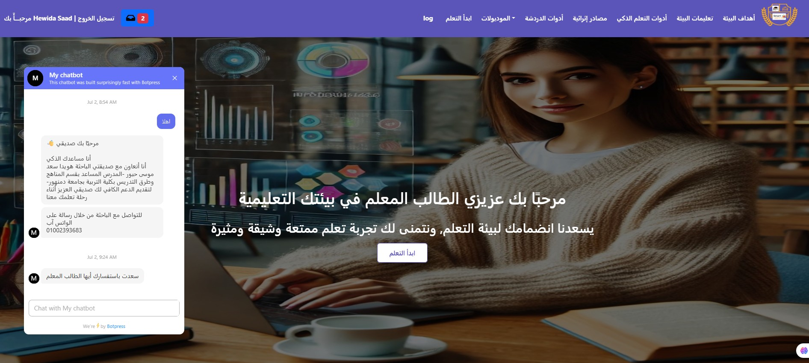
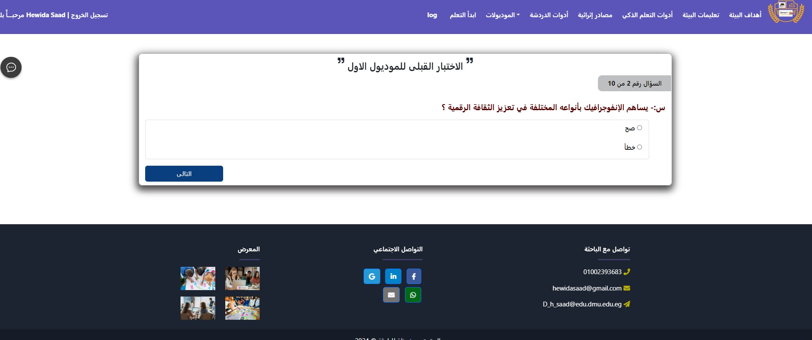

# 🎓 AI Teacher-Student Platform

A **Smart Educational Web Application** built with **Django** that leverages **AI-powered adaptive learning** to enhance student engagement and personalize the learning experience.  
Currently in use by **Menoufia University** students, this platform delivers tailored educational content, intelligent assessments, and real-time assistance.

---

## 🌟 Overview

This application is based on **adaptive learning techniques** inspired by the vision of **Dr. Hewida Saad**.  
It supports two learning paths — **Simplification** and **Complexity** — ensuring that each student receives content aligned with their skill level.

At the start, students take an **initial assessment** to determine their learning path.  
As they progress:
- Each module is followed by a quiz.
- Students must demonstrate understanding before advancing.
- An **AI chatbot** is available to answer questions at any stage.

---

## ✨ Key Features

- **AI-Powered Chatbot** 🤖 – Instant answers to student queries.
- **Adaptive Learning Paths** 📚 – Personalized content based on performance.
- **Initial Assessment Test** 📝 – Automatically determines the learning level.
- **Dynamic MCQ Quizzes** ✅ – Knowledge checks after each module.
- **Student Progress Tracking** 📈 – Monitored and analyzed via the admin panel.
- **Admin Dashboard** 🖥️ – Manage questions, view reports, and track performance.
- **Messaging System** 💬 – Communicate between students and admin/instructors.
- **Fully Responsive Design** 📱 – Works on mobile, tablet, and desktop.

---

## 🛠️ Technologies Used

- **Backend:** Django (Python)
- **Frontend:** HTML5, CSS3, JavaScript
- **Database:** SQLite (configurable to PostgreSQL/MySQL)
- **AI/Chatbot:** Integrated NLP-based chatbot system
- **Authentication:** Django’s built-in user authentication
- **Hosting:** PythonAnywhere

---

## 📂 Project Structure

📦 AI-Teacher-Student
- 📂 ai_teacher_student # Main Django app
- 📂 templates # HTML templates
- 📂 static # CSS, JS, and images
- 📜 manage.py # Django project manager
- 📜 requirements.txt # Dependencies
- 📜 README.md # Project documentation

---

## 🚀 Live Demo

🌐 **Live Application:** [AI Teacher-Student](https://hewidasaad.pythonanywhere.com/)  
📦 **GitHub Repo:** [AI Teacher-Student GitHub](https://github.com/ashehta700/AI-Teacher-Student)

---

## 💻 Installation & Setup

1. Clone the repository:
```bash
   git clone https://github.com/ashehta700/AI-Teacher-Student.git
   cd AI-Teacher-Student
```
2. Create and activate a virtual environment:
```bash
python -m venv venv
source venv/bin/activate      # On macOS/Linux
venv\Scripts\activate         # On Windows
```
3. Install dependencies:
```bash
pip install -r requirements.txt
```
4. Apply database migrations:
```bash
python manage.py migrate
```
5. Create a superuser (Admin):
```bash
python manage.py createsuperuser
```
6.Run the development server:
```bash
python manage.py runserver
```
7. Open your browser and navigate to:
```bash
http://127.0.0.1:8000/
```
📸 Screenshots






🎯 Learning Outcomes
* Understanding adaptive learning algorithms.
* Building a multi-role Django application.
* Integrating chatbot technology into educational platforms.
* Implementing MCQ-based quizzes with performance tracking.
* Designing a responsive, user-friendly UI.


🖋️ Author
Ahmed Shehta
📧 Email: ashehta700@gmail.com
🔗 website : https://ahmed-shehta.netlify.app
💼 LinkedIn: [Ahmed Shehta](https://www.linkedin.com/in/ahmed-shehta/)

📜 License
This project is licensed under the MIT License – free to use, modify, and distribute with attribution.


